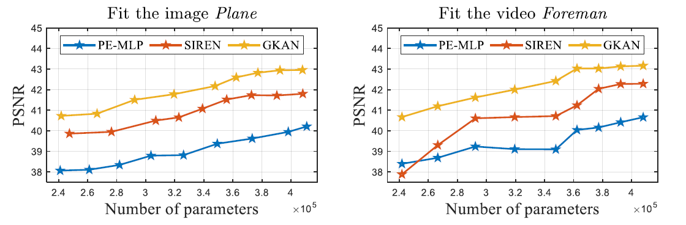

# GKAN-for-INR
Generalized Kolmogorov-Arnold Network for Implicit Neural Representation

The main aim of this letter is to study the potential of Kolmogorov-Arnold network (KAN) for implicit neural representation (INR). We first show that KAN can be reformulated as a special type of MLP with multiple activation functions performed on inputs after repetition. Inspired by this representation, we propose a generalized KAN (GKAN) that employs multiple sinusoidal activation functions with different frequencies to continuously represent signals under the INR framework. Through analysis from the neural tangent kernel and Lipschitz smooth perspectives, we reveal the underlying merits of GKAN as compared with traditional MLP structures for INR. Numerical experiments on image, video, point cloud, and neural radiance field representations showcase the effectiveness of the proposed GKAN for continuously representing signals. 

